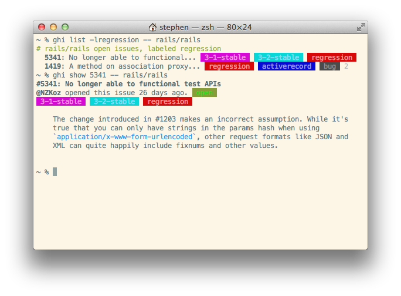

# ghi

GitHub Issues on the command line. Use your `$EDITOR`, not your browser.

`ghi` was originally created by [Stephen Celis](https://github.com/stephencelis), and is now maintained by [Alex Chesters](https://github.com/alexchesters).

## Install

Via brew ([latest stable release](https://github.com/stephencelis/ghi/releases/latest)):
``` sh
brew install ghi
```

Via gem ([latest stable release](https://github.com/stephencelis/ghi/releases/latest)):
``` sh
gem install ghi
```

Via curl (latest bleeding-edge versions, may not be stable):
``` sh
curl -sL https://raw.githubusercontent.com/stephencelis/ghi/master/ghi > ghi && \
chmod 755 ghi && \
mv ghi /usr/local/bin
```

## Usage

```
usage: ghi [--version] [-p|--paginate|--no-pager] [--help] <command> [<args>]
           [ -- [<user>/]<repo>]

The most commonly used ghi commands are:
   list        List your issues (or a repository's)
   show        Show an issue's details
   open        Open (or reopen) an issue
   close       Close an issue
   edit        Modify an existing issue
   comment     Leave a comment on an issue
   label       Create, list, modify, or delete labels
   assign      Assign an issue to yourself (or someone else)
   milestone   Manage project milestones
   status      Determine whether or not issues are enabled for this repo
   enable      Enable issues for the current repo
   disable     Disable issues for the current repo

See 'ghi help <command>' for more information on a specific command.
```

## Contributing

If you're looking for a place to start, there are [issues we need help with](https://github.com/stephencelis/ghi/issues?q=is%3Aopen+is%3Aissue+label%3A%22help+wanted%22)!

Once you have an idea of what you want to do, there is a section in the [wiki](https://github.com/stephencelis/ghi/wiki/Contributing) to provide more detailed information but the basic steps are as follows.

1. Fork this repo
2. Do your work:
  1. Make your changes
  2. Run `rake build`
  3. Make sure your changes work
3. Open a pull request!

## FAQ

FAQs can be found in the [wiki](https://github.com/stephencelis/ghi/wiki/FAQ)

## Screenshot



## LICENSE

(The MIT License)

© 2009–2013 Stephen Celis (<stephen@stephencelis.com>).
json-pure © Genki Takiuchi.

Permission is hereby granted, free of charge, to any person obtaining a copy of
this software and associated documentation files (the "Software"), to deal in
the Software without restriction, including without limitation the rights to
use, copy, modify, merge, publish, distribute, sublicense, and/or sell copies
of the Software, and to permit persons to whom the Software is furnished to do
so, subject to the following conditions:

The above copyright notice and this permission notice shall be included in all
copies or substantial portions of the Software.

THE SOFTWARE IS PROVIDED "AS IS", WITHOUT WARRANTY OF ANY KIND, EXPRESS OR
IMPLIED, INCLUDING BUT NOT LIMITED TO THE WARRANTIES OF MERCHANTABILITY,
FITNESS FOR A PARTICULAR PURPOSE AND NONINFRINGEMENT. IN NO EVENT SHALL THE
AUTHORS OR COPYRIGHT HOLDERS BE LIABLE FOR ANY CLAIM, DAMAGES OR OTHER
LIABILITY, WHETHER IN AN ACTION OF CONTRACT, TORT OR OTHERWISE, ARISING FROM,
OUT OF OR IN CONNECTION WITH THE SOFTWARE OR THE USE OR OTHER DEALINGS IN THE
SOFTWARE.
